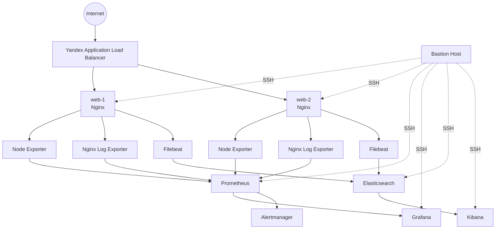

# Yandex Cloud DevOps Infrastructure

Production-like инфраструктурный проект в **Yandex Cloud**, построенный с использованием **Terraform** и **Ansible**.

Проект включает отказоустойчивый веб-слой, балансировку нагрузки, мониторинг, alerting, централизованный сбор логов и резервное копирование.

---

## Архитектура



---

## Основные компоненты

| Компонент | Назначение |
|---|---|
| Terraform | Создание инфраструктуры Yandex Cloud |
| Ansible | Настройка виртуальных машин и сервисов |
| Bastion | Единственная точка SSH-доступа к private VM |
| Nginx | Web-сервер на двух VM |
| Application Load Balancer | Распределение HTTP-трафика между web-1 и web-2 |
| Node Exporter | Системные метрики Linux |
| Nginx Log Exporter | Метрики HTTP-запросов Nginx |
| Prometheus | Сбор и хранение метрик |
| Grafana | Визуализация метрик |
| Alertmanager | Обработка Prometheus alerts |
| Filebeat | Отправка Nginx logs |
| Elasticsearch | Хранение и индексирование логов |
| Kibana | Просмотр и анализ логов |

---

# Сетевая архитектура

Используется одна VPC:

```text
devops-practice-vpc
```

Созданы четыре subnet в двух availability zones.

| Subnet | CIDR | Zone | Назначение |
|---|---|---|---|
| public-a | `10.10.10.0/24` | ru-central1-a | Bastion, Grafana, Kibana |
| private-a | `10.10.20.0/24` | ru-central1-a | web-1, Prometheus, Elasticsearch |
| public-b | `10.10.30.0/24` | ru-central1-b | ALB |
| private-b | `10.10.40.0/24` | ru-central1-b | web-2 |

Private subnet используют **NAT Gateway** для исходящего доступа в интернет.

Это позволяет устанавливать пакеты и получать обновления без назначения public IP внутренним серверам.

---

# Виртуальные машины

| VM | Network | Public access |
|---|---|---|
| bastion | public-a | SSH |
| web-1 | private-a | через ALB |
| web-2 | private-b | через ALB |
| prometheus | private-a | нет |
| grafana | public-a | TCP 3000 |
| elasticsearch | private-a | нет |
| kibana | public-a | TCP 5601 |

Актуальные IP-адреса можно получить через Terraform:

```bash
cd terraform
terraform output
```

Пример текущего состояния:

```text
alb_public_ip            = 158.160.180.213
bastion_public_ip        = 111.88.240.38
grafana_public_ip        = 62.84.118.199
kibana_public_ip         = 111.88.249.195

web_1_private_ip         = 10.10.20.15
web_2_private_ip         = 10.10.40.4
prometheus_private_ip    = 10.10.20.35
elasticsearch_private_ip = 10.10.20.33
```

> Public IP некоторых VM назначаются динамически и могут измениться после stop/start.  
> Поэтому актуальные значения следует получать через `terraform output`.

---

# Terraform

Terraform используется для создания:

- VPC;
- subnet;
- NAT Gateway;
- route table;
- Security Groups;
- Bastion;
- web-1;
- web-2;
- Prometheus;
- Grafana;
- Elasticsearch;
- Kibana;
- Application Load Balancer;
- Target Group;
- Backend Group;
- HTTP Router;
- Virtual Host.

Основные команды:

```bash
cd terraform

terraform init
terraform fmt
terraform validate
terraform plan
terraform apply
```

Проверка финального состояния:

```bash
terraform plan
```

Ожидаемый результат:

```text
No changes. Your infrastructure matches the configuration.
```

---

# Ansible

Ansible выполняется с управляющей Ubuntu VM.

Доступ к private VM осуществляется через Bastion:

```text
Control VM
    |
    | SSH
    v
Bastion
    |
    +----> web-1
    +----> web-2
    +----> prometheus
    +----> elasticsearch
```

Основные inventory-группы:

```text
web
monitoring
├── prometheus_servers
└── grafana_servers

logging
├── elasticsearch
└── kibana
```

Проверка connectivity:

```bash
ansible -i inventory/hosts.yml all -m ping
```

---

# Web layer

На двух VM через Ansible устанавливается Nginx:

```text
web-1
web-2
```

На обоих размещается одинаковая статическая страница.

Проверка:

```bash
curl http://<ALB_PUBLIC_IP>
```

---

# Application Load Balancer

Yandex Application Load Balancer распределяет HTTP-трафик между:

```text
web-1
web-2
```

Используется health check:

```text
HTTP
port: 80
path: /
```

ALB автоматически исключает неисправный backend из балансировки.

---

# Проверка High Availability

Для проверки отказоустойчивости был проведён реальный failover test.

Начальное состояние:

```text
web-1 → healthy
web-2 → healthy
```

Затем Nginx был остановлен на `web-1`.

```bash
ansible -i inventory/hosts.yml web-1 -b -m service \
  -a "name=nginx state=stopped"
```

После health checks:

```text
web-1 → unhealthy
web-2 → healthy
```

При этом сайт через ALB продолжал работать.

После восстановления Nginx:

```bash
ansible -i inventory/hosts.yml web-1 -b -m service \
  -a "name=nginx state=started"
```

backend снова получил состояние:

```text
healthy
```

Таким образом подтверждён автоматический failover между двумя web-серверами.

---

# Monitoring

Monitoring stack:

```text
web-1 ── Node Exporter ──┐
                         │
web-2 ── Node Exporter ──┼──> Prometheus ──> Grafana
                         │
Nginx Log Exporter ──────┘
```

## Node Exporter

На web-1 и web-2 работает:

```text
TCP 9100
```

Prometheus собирает:

- CPU;
- RAM;
- disk usage;
- disk I/O;
- network;
- load average;
- filesystem;
- system uptime.

---

## Nginx Log Exporter

Nginx Log Exporter анализирует:

```text
/var/log/nginx/access.log
```

и публикует Prometheus metrics:

```text
TCP 4040
```

Пример:

```text
nginx_http_response_count_total
nginx_http_response_size_bytes
```

Prometheus успешно получает метрики с обоих web-хостов.

---

# Prometheus

Prometheus работает только во внутренней сети:

```text
10.10.20.35:9090
```

Основные scrape targets:

```text
localhost:9090
10.10.20.15:9100
10.10.40.4:9100
10.10.20.15:4040
10.10.40.4:4040
```

Проверка:

```promql
up
```

В штатном режиме все targets возвращают:

```text
1
```

---

# Grafana

Grafana используется для визуализации инфраструктурных метрик.

Настроен Prometheus datasource:

```text
http://10.10.20.35:9090
```

Используются:

- Node Exporter dashboard;
- custom infrastructure dashboard;
- CPU metrics;
- RAM metrics;
- disk metrics;
- network metrics;
- host availability;
- Nginx HTTP metrics.

---

# Alerting

Prometheus использует отдельный файл alert rules.

Реализованы alerts для инфраструктурных проблем, включая:

```text
NodeDown
```

Пример логики:

```promql
up{job="node_exporter"} == 0
```

Alert отправляется в Alertmanager.

---

# Реальный Alert test

Для проверки alerting был остановлен Node Exporter на `web-1`.

Получено:

```text
web-1 → up = 0
web-2 → up = 1
```

После заданного времени Prometheus перевёл:

```text
NodeDown
```

в состояние:

```text
firing
```

Alert успешно появился в Alertmanager.

После запуска Node Exporter:

```text
web-1 → up = 1
web-2 → up = 1
```

alert автоматически завершился.

---

# Centralized Logging

Logging pipeline:

```text
web-1 Nginx ── Filebeat ──┐
                          ├──> Elasticsearch ──> Kibana
web-2 Nginx ── Filebeat ──┘
```

---

## Filebeat

Filebeat установлен на:

```text
web-1
web-2
```

Он собирает:

```text
/var/log/nginx/access.log
/var/log/nginx/error.log
```

Дополнительные поля:

```text
app_service: nginx
log_type: access/error
node: web-1/web-2
```

Логи отправляются на:

```text
http://10.10.20.33:9200
```

---

## Elasticsearch

Elasticsearch работает во внутренней сети:

```text
10.10.20.33:9200
```

Cluster:

```text
devops-logging
```

Deployment:

```text
single-node
```

Логи Nginx хранятся в:

```text
devops-nginx-*
```

Проверка количества документов:

```bash
curl "http://127.0.0.1:9200/devops-nginx-*/_count?pretty"
```

Во время проверки в Elasticsearch было более:

```text
1400 nginx log events
```

---

## Kibana

Kibana подключена к Elasticsearch:

```text
http://10.10.20.33:9200
```

Создан Data View:

```text
Nginx Logs
```

Index pattern:

```text
devops-nginx-*
```

Timestamp:

```text
@timestamp
```

В Discover доступны поля:

```text
node
app_service
log_type
message
host.name
@timestamp
```

Примеры фильтров:

```text
node : "web-1"
```

```text
node : "web-2"
```

```text
log_type : "access"
```

---

# Backup

Для Elasticsearch создан snapshot boot disk:

```text
elasticsearch-backup-20260905
```

Snapshot был создан после корректной остановки Elasticsearch.

Статус:

```text
READY
```

После создания snapshot Elasticsearch был снова запущен и проверен.

Cluster health:

```text
status: yellow
number_of_nodes: 1
unassigned_primary_shards: 0
```

`yellow` является ожидаемым состоянием для данного single-node lab, поскольку replica shard невозможно разместить на второй Elasticsearch node.

---

# Security

Основные принципы:

- web VM не имеют public IP;
- Prometheus не имеет public IP;
- Elasticsearch не имеет public IP;
- SSH-доступ к private VM выполняется через Bastion;
- Grafana доступна только с административного CIDR;
- Kibana доступна только с административного CIDR;
- Elasticsearch `9200` доступен только необходимым внутренним компонентам;
- Node Exporter доступен только Prometheus;
- Nginx Log Exporter доступен только Prometheus;
- ALB health checks разрешены отдельными Security Group rules.

Схема:

```text
Internet
   |
   +------> ALB :80
   |
   +------> Bastion :22
   |
   +------> Grafana :3000
   |
   +------> Kibana :5601

Private services:
Prometheus     :9090
Elasticsearch  :9200
Node Exporter  :9100
Nginx Exporter :4040
```

## Elasticsearch security note

В учебном стенде встроенная authentication/TLS Elasticsearch отключена:

```yaml
xpack.security.enabled: false
```

Это сделано для упрощения лабораторного deployment.

Elasticsearch не имеет public IP и защищён Security Group.

Для production-среды должны использоваться TLS, authentication и secrets management.

---

# Проверка idempotency

Все Ansible playbooks были повторно запущены после завершения конфигурации.

Проверялись:

```bash
ansible-playbook -i inventory/hosts.yml site.yml

ansible-playbook -i inventory/hosts.yml node-exporter.yml

ansible-playbook -i inventory/hosts.yml nginx-log-exporter.yml

ansible-playbook -i inventory/hosts.yml prometheus.yml

ansible-playbook -i inventory/hosts.yml grafana.yml

ansible-playbook -i inventory/hosts.yml elasticsearch.yml

ansible-playbook -i inventory/hosts.yml filebeat.yml

ansible-playbook -i inventory/hosts.yml kibana.yml
```

Финальный результат:

```text
unreachable=0
failed=0
```

Конфигурация является повторяемой и управляется Ansible.

---

# Проверка Terraform

Перед завершением проекта выполнены:

```bash
terraform fmt -check
terraform validate
terraform plan
```

Результат:

```text
Success! The configuration is valid.

No changes. Your infrastructure matches the configuration.
```

---

# Структура репозитория

```text
.
├── terraform/
│   ├── versions.tf
│   ├── providers.tf
│   ├── variables.tf
│   ├── terraform.tfvars
│   ├── network.tf
│   ├── nat.tf
│   ├── security-groups.tf
│   ├── bastion.tf
│   ├── web.tf
│   ├── monitoring.tf
│   ├── logging.tf
│   ├── alb.tf
│   └── outputs.tf
│
├── ansible/
│   ├── inventory/
│   ├── group_vars/
│   ├── roles/
│   │   ├── common/
│   │   ├── nginx/
│   │   ├── node_exporter/
│   │   ├── nginx_log_exporter/
│   │   ├── prometheus/
│   │   ├── grafana/
│   │   ├── elasticsearch/
│   │   ├── filebeat/
│   │   └── kibana/
│   │
│   ├── site.yml
│   ├── node-exporter.yml
│   ├── nginx-log-exporter.yml
│   ├── prometheus.yml
│   ├── grafana.yml
│   ├── elasticsearch.yml
│   ├── filebeat.yml
│   └── kibana.yml
│
├── site/
├── monitoring/
├── logging/
│
├── docs/
│   ├── architecture/
│   └── screenshots/
│
├── .gitignore
└── README.md
```

---

# Основные проверки проекта

### ALB

```bash
curl http://$(terraform output -raw alb_public_ip)
```

### Ansible connectivity

```bash
ansible -i inventory/hosts.yml all -m ping
```

### Prometheus targets

```promql
up
```

### Elasticsearch

```bash
curl http://127.0.0.1:9200
```

### Nginx logs

```bash
curl "http://127.0.0.1:9200/devops-nginx-*/_count?pretty"
```

### Terraform

```bash
terraform validate
terraform plan
```

---

# Screenshots

Рекомендуемые подтверждения работы проекта:

```text
docs/screenshots/
├── terraform-plan.png
├── terraform-output.png
├── yc-instances.png
├── alb.png
├── alb-ha-test.png
├── prometheus-targets.png
├── grafana-node-exporter.png
├── grafana-custom-dashboard.png
├── prometheus-alert.png
├── alertmanager.png
├── elasticsearch.png
├── kibana-discover.png
├── snapshot.png
└── ansible-idempotency.png
```

---

# Что было проверено на практике

В проекте не только создана инфраструктура, но и проведены реальные эксплуатационные проверки:

- отказ одного Nginx backend;
- автоматическое переключение ALB на второй backend;
- восстановление backend;
- остановка Node Exporter;
- переход Prometheus alert в `firing`;
- доставка alert в Alertmanager;
- восстановление monitoring target;
- сбор системных metrics;
- сбор Nginx metrics;
- сбор Nginx access/error logs;
- доставка Filebeat → Elasticsearch;
- просмотр logs через Kibana;
- создание disk snapshot;
- повторный запуск Ansible playbooks;
- финальный Terraform plan без инфраструктурного drift.

---

# Результат

В результате создан production-like DevOps стенд, демонстрирующий практическую работу с:

```text
Terraform
Ansible
Yandex Cloud
Linux
Nginx
Application Load Balancer
Networking
Security Groups
Prometheus
Grafana
Alertmanager
Node Exporter
Nginx Log Exporter
Filebeat
Elasticsearch
Kibana
Backup / Snapshots
High Availability testing
Infrastructure as Code
Configuration Management
Observability
```

Проект полностью воспроизводим через Terraform + Ansible и содержит проверки отказоустойчивости, мониторинга, alerting, logging и backup.
